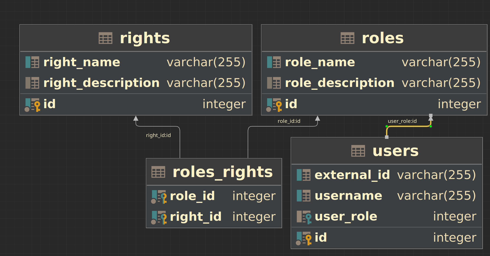

# Гайд по авторизации в Micronaut

Всем привет. В [предыдущей статье](https://habr.com/ru/companies/X5Tech/articles/715634/) я описал процесс аутентификации в `Micronaut`. Но аутентификация без авторизации мертва! Ну или крайне мало применима. Поэтому предлагаю заглянуть под кат и оценить различные механизмы авторизации в данном фреймворке, а заодно узнать, как это все тестировать.

Для начала – краткая выжимка по тому, что такое аутентификация и авторизация, чтобы больше не путаться:

- Аутентификация – ~~процесс идентификации пользователя, при котором система может однозначно определить, является ли субъект действительным и имеющим право на доступ. Субъект в данном случае необязательно живой человек, пользователем вашей системы так же могут быть другие системы, микросервисы внутри вашей архитектуры, и т.д. Если говорить проще, то аутентификация~~ это просто подтверждение учетных данных через предоставленный механизм (Basic, OAuth2.0, etc.).
- Авторизация - ~~процесс установления прав доступа и разрешений для пользователя или системы с целью определения, какие ресурсы и функционал они могут использовать в информационной системе.~~ это процесс проверки пользователя на выполнение тех или иных действий.

Скелет приложения с аутентификацией я собираюсь использовать из своей [предыдущей статьи](https://habr.com/ru/companies/X5Tech/articles/715634/), сделав, однако, апгрейд до четвертой версии `Micronaut`, которая вышла в [июле](https://habr.com/ru/companies/X5Tech/articles/750396/) этого года.

<details>
  <summary>Тут можно найти список изменений, которые мне пришлось сделать:</summary>
  <body>
    <ul>
      <li>Добавлен snakeyaml и micronaut-serde-processor.</li>
      <li>Добавлен блок aot с оптимизациями.</li>
      <li>Убрана зависимость jakarta.</li>
      <li>Немного переписан OpenIdUserDetailsMapper.</li>
      <li>Добавлены gradle плагины.</li>
    </ul>
  </body>
</details>

Если рассматривать авторизацию в `Micronaut` только с технической части, то можно отказаться от базы данных, так как никто не мешает заинжектить `jwtTokenGenerator` и просто вставлять нужный набор ролей (и в тестах так и будет, потому что как иначе?). Но, во-первых, само приложение без этого не будет настоящим и с ним нельзя будет поиграться на локалке. Во-вторых, это просто неинтересно. Так что некоторый код я добавлю, но не стоит воспринимать это, как руководство к действию, а скорее как некоторый минимально живой шаблон, который нужно допиливать.

## Описание таблиц

Для начала стоит немного рассказать про структуру базы данных. Всего будут четыре таблицы: `user`, `roles`, `rules` и `roles_rules`. Вот их описание:



Можно сказать, что это джентльменский набор при реализации авторизации. В целом, всё достаточно прозаично, поэтому не будем надолго здесь останавливаться, лишь обозначим некоторые условности:

1. Придерживаемся политики: всё, что не разрешено - запрещено.
2. Права атомарны, каждое отвечает за конкретное действие.
3. Роль может иметь сколько угодно прав, но дубликатов быть не должно
4. Пользователь может иметь только одну роль

## Какие методы авторизации поддерживает `Micronaut`?

Решение об успешном или неуспешном ответе принимает `SecurityFilter` благодаря коллекции определенных заранее правил безопасности. `Micronaut` изначально содержит четыре типа правил безопасности: `IpPatternRule`, `SecuredAnnotation`, `ConfigurationInterceptUrlMapRule`, `SensetiveEndpoitRule`. Если же этих правил недостаточно, то всегда можно добавить еще, имплементировав `SecurityRule`.

Правила безопасности возвращают `publisher`, который содержит единственный статус `SecurityRuleResult`. Ниже представлена таблица с описанием этих результатов:

| Результат                                                                                                                                   | Описание                                                                               |
|---------------------------------------------------------------------------------------------------------------------------------------------|----------------------------------------------------------------------------------------|
| [ALLOWED](https://micronaut-projects.github.io/micronaut-security/latest/api/io/micronaut/security/rules/SecurityRuleResult.html#ALLOWED)   | Доступ должен быть предоставлен, и больше никакие правила проверяться не будут.         |
| [REJECTED](https://micronaut-projects.github.io/micronaut-security/latest/api/io/micronaut/security/rules/SecurityRuleResult.html#REJECTED) | Доступ должен быть запрещен, и больше никакие правила проверяться не будут.             |
| [UNKNOWN](https://micronaut-projects.github.io/micronaut-security/latest/api/io/micronaut/security/rules/SecurityRuleResult.html#UNKNOWN)   | Правило не может определить результат, поэтому будут рассматриваться следующие правила. |

Важные моменты, которые стоит отметить:

1. Если все определенные заранее правила вернут результат ___UNKNOWN___, то запрос будет отклонен со статусом ___REJECTED___.
2. [`SecurityFilter`](https://micronaut-projects.github.io/micronaut-security/latest/api/io/micronaut/security/filters/SecurityFilter.html) проверяет правила по очереди. Как только одно правило возвращает ___ALLOWED___ или ___REJECTED___, проверка правил прекращается.

Правила безопасности имплементируют интерфейс `Ordered`, так все существующие правила безопасности содержат статическую переменную `ORDER`. Правила проверяются по восходящему порядку. Таким образом, создав свое правило, вы можете определить, в какую очередь оно будет проверяться.

В табличке ниже представлены все встроенные правила:

| Правило                                                                                                                | Порядок (Order) | Условие принятия                                                | Условие отказа                                                       | Условие с результатом неизвестно                                                   |
|------------------------------------------------------------------------------------------------------------------------|-----------------|-----------------------------------------------------------------|----------------------------------------------------------------------|------------------------------------------------------------------------------------|
| [IpPatternsRule](https://micronaut-projects.github.io/micronaut-security/latest/guide/#ipPattern)                      | -300            | Никогда.                                                         | Ни один из шаблонов IP не соответствует адресу хоста.                | Адрес соответствует хотя бы одному из шаблонов, или адрес не может быть определен. |
| [SecuredAnnotationRule](https://micronaut-projects.github.io/micronaut-security/latest/guide/#secured)                 | -200            | Хотя бы одна из необходимых указанных ролей есть у пользователя. | У пользователя нет ни одной роли, указанной в аннотации.    | Нет аннотаций безопасности у данного ednpoint.                                      |
| [ConfigurationInterceptMapRule](https://micronaut-projects.github.io/micronaut-security/latest/guide/#interceptUrlMap) | -100            | Хотя бы одна из необходимых указанных ролей есть у пользователя. | У пользователя нет ни одной роли, указанной в конфигурации. | Ни один URL-паттерн не совпадает с запросом.                                        |
| [SensetiveEnpoitRule](https://micronaut-projects.github.io/micronaut-security/latest/guide/#builtInEndpointsAccess)    | 0               | Пользователь аутентифицирован.                                   | Пользователь не аутентифицирован.                                     | Endpoint не является sensitive.                                                     |


Давайте поговорим про каждое немного подробнее.

### Блокировка по IP

По умолчанию, когда модуль безопасности активен, ваш сервер доступен с любого IP-адреса. Однако, это можно ограничить, добавив следующие строчки в `application.yml`:

```
micronaut:
  security:
    ip-patterns:
      - 127.0.0.1
      - 192.168.1.*
```

С помощью кода, приведенного выше, можно запретить доступ к серверу со всех адресов, которые не перечислены. При этом, такое правило не разрешает никаких действий, а только отклоняет все запросы, которые пришли с других IP-адресов.

### URL-правила

Для регулирования доступа к вашим ресурсам можно использовать указание правил доступа через адрес.

```
micronaut:
  security:
    intercept-url-map:
      -
        pattern: /images/*
        http-method: GET
        access:
          - isAnonymous()
      -
        pattern: /books
        access:
          - isAuthenticated()
      -
        pattern: /books/grails
        http-method: POST
        access:
          - ROLE_GRAILS
          - ROLE_GROOVY
      -
        pattern: /books/grails
        http-method: PUT
        access:
          - ROLE_ADMIN
```

В приведенном выше фрагменте кода можно увидеть несколько правил:

* Все адреса, начинающиеся с `/images/**`, доступны для аутентифицированных и анонимных пользователей с помощью `GET`-метода.
* Адрес `/books` доступен для всех аутентифицированных пользователей
* Адрес `/books/grails` доступен для пользователей, у которых есть хотя бы одна роль из перечисленных (`ROLE_GRAILS`, `ROLE_GROOVY`) и происходит `POST`-запрос.
* Тот же адрес доступен только для пользователей с ролью `ROLE_ADMIN`, если происходит `PUT`-запрос.

Таким образом, в данном листинге любой endpoint может быть определен с помощью паттерна адреса, и дополнительно может быть указан метод, по которому доступен данный endpoint.

Если запрос может подойти под несколько правил, определенных вами, будет использовано то, которое дополнительно определяет еще и метод запроса. Если же несколько правил используют один и тот же паттерн, но не определяют метод запроса, будет использовано то, которое идет первым. Например:

```
micronaut:
  security:
    intercept-url-map:
      - pattern: /v1/myResource/**
        httpMethod: GET
        access:
          - isAnonymous()
      - pattern: /v1/myResource/**
        access:
          - isAuthenticated()
```

В примере выше определяется, что все `GET`-запросы с паттерном `/v1/myResource/**` доступны для любых пользователей. Запросы, которые используют тот же паттерн, но их метод отличен от `GET`, будут доступны только для аутентифицированных пользователей.


### Аннотации

Настало время поговорить про самый популярный и, в то же время самый гибкий способ - аннотации. В первую очередь, надо упомянуть про стандартную для `Micronaut` аннотацию - `@Secured`. 

```
@Controller("/example")
@Secured(SecurityRule.IS_AUTHENTICATED) // Доступ к этому контроллеру по умолчанию есть только у аутентифицированных пользователей
public class ExampleController {

    @Produces(MediaType.TEXT_PLAIN)
    @Get("/admin")
    @Secured({"ROLE_ADMIN", "ROLE_X"}) // Доступ к этому endpoint есть у пользователей с ролями ROLE_ADMIN или ROLE_X
    public String withroles() {
        return "You have ROLE_ADMIN or ROLE_X roles";
    }

    @Produces(MediaType.TEXT_PLAIN)
    @Get("/anonymous")
    @Secured(SecurityRule.IS_ANONYMOUS)  // Доступ к этому endpoint есть у всех пользователей, даже неаутентифицированных
    public String anonymous() {
        return "You are anonymous";
    }

    @Produces(MediaType.TEXT_PLAIN)
    @Get("/authenticated") // Применяется правило, объявленное в начале файла
    public String authenticated(Authentication authentication) {
        return authentication.getName() + " is authenticated";
    }
}
```

#### Аннотации Jakarta

Также можно использовать аннотации `Jakarta`:

* `jakarta.annotation.security.PermitAll`
* `jakarta.annotation.security.RolesAllowed`
* `jakarta.annotation.security.DenyAll`

```
@Controller("/example")
public class ExampleController {

    @Produces(MediaType.TEXT_PLAIN)
    @Get("/admin")
    @RolesAllowed({"ROLE_ADMIN", "ROLE_X"}) // Доступ к endpoint есть у пользователей с ролями ROLE_ADMIN или ROLE_X 
    public String withroles() {
        return "You have ROLE_ADMIN or ROLE_X roles";
    }

    @Produces(MediaType.TEXT_PLAIN)
    @Get("/anonymous")
    @PermitAll  // Разрешает доступ до endpoint всем пользователям
    public String anonymous() {
        return "You are anonymous";
    }
}
```

#### Выражения в аннотациях

Начиная с четвертой версии, в `Micronaut` появилась возможность использовать выражения в аннотации `@Secured`. Например:

```
@Controller("/authenticated")
public class ExampleController {

    @Secured("#{ user?.attributes?.get('email') == 'sherlock@micronaut.example' }")
    @Produces(MediaType.TEXT_PLAIN)
    @Get("/email")
    public String authenticationByEmail(Principal principal) {
        return principal.getName() + " is authenticated";
    }
}
```

В данном примере, доступ до endpoint есть только у пользователя с адресом электронной почты "sherlock@micronaut.example"

## Обзор механизма авторизации

Процесс авторизации состоит из нескольких понятных действий:

1. Сначала происходит чтение конфигурации и инициализация бинов. 
   1. Например, `ConfigurationInterceptUrlMapRule`, который в свою очередь распознает бины типа `InterceptUrlMapPattern` благодаря свойствам, объявленным в `application.yml` свойством `micronaut.security.intercept-url-map`
   2. Или `SecuredAnnotationRule`, который отвечает за обработку `@Secured` аннотаций. Так же стоит отметить, что правила безопасности через аннотации по приоритету выше, чем URL-правила.
2. При поступлении запроса отрабатывает цепочка фильтров, которые выполнят проверку на доступ. Следующие шаги будут объяснены для URL-правила, хотя разница между ними и аннотациями не сильно большая.
3. `HttpHeaderTokenReader` - сначала будет произведен поиск JWT в запросе
4. `DefaultTokenResolver` - распознавание токена
5. `JwtValidator` - валидация токена
6. `SecurityFilter` - сопоставление токена с параметрами. Кто выпустил, когда, когда истекает, какие роли и атрибуты есть
7. `IpPatternsRule` - проверка на совпадение запроса по IP-правилу
8. `InterceptUrlMapRule` - поиск совпадение по URL и типу запроса
9. `AbstractSecurityRule` - валидация правила
10. `SecurityFilter` - если предыдущий шаг завершился успешно, то данный фильтр примет решение об авторизации данного запроса

## Как это тестировать

Итак, встает вопрос, как же протестировать, что только пользователь сможет воспользоваться нашим API при соблюдении определенных условий? К счастью, `Micronaut` предоставляет весь необходимый функционал, и сам процесс достаточно прост.

```
@MicronautTest // (1)
public class AnnotationTest {

    @Inject
    JwtTokenGenerator jwtTokenGenerator; // (2)

    @Inject
    @Client("/annotation")
    HttpClient client; // (3)
    
    @Test
    public void shouldReturn200_whenGoingToOnlyAuthenticated_givenAuthentication() {
        var authentication = Authentication.build("testUser", List.of("ROLE_SOME")); // (4)
        var token = jwtTokenGenerator.generateToken(authentication, 1000); // (5)

        var request = HttpRequest.GET("/only-authenticated")
                .accept(MediaType.TEXT_PLAIN_TYPE)
                .cookie(Cookie.of("JWT", token.get())); // (6)
        var response = client.toBlocking().exchange(request, String.class);

        assertEquals(HttpStatus.OK, response.getStatus()); // (7)
        assertEquals("Allowed only to authenticated users", response.body()); // (7)
    }
}
```

1. Для начала указываем, что нужно поднимать контекст для данного теста
2. Инжектим генератор JWT токенов. Нужно отметить, что для теста совсем не важно, какая фраза используется для генерации токенов.
3. Также потребуется подключить клиент, для того чтобы симулировать как можно более точно сам процесс запроса от пользователя.
4. Начинается самое интересное: создаем объект `Authentication` - наш фейковый пользователя обретает какую-то идентичность и теперь имеет `userName` и даже роль `ROLE_SOME`. 
5. Следующий шаг - сгенерировать токен с помощью `jwtTokenGenerator`.
6. В зависимости от того, какая стратегия аутентификации выбрана - `cookie` или `bearer`, нужно выбрать, как именно прикрепить только что созданный токен к запросу. Мне больше нравится именно `cookie`-аутентификация, но вы можете выбрать то, что больше нравится вам :)
7. Собственно, теперь самое главное - убедиться, что все работает. В данном случае ожидаем ответ `OK` с заданной строкой в теле ответа.

Другие примеры тестирования можно найти в [репозитории](https://github.com/jz36/authorization-micronaut). 

Там есть примеры тестов для авторизации на основе аннотаций и URL-правил. Тестов на основе ip-адреса нет, потому что это достаточно непросто сделать на локальной машине.

## Заключение

На этом разбор работы механизма авторизации в `Micronaut` можно считать завершенным. Надеюсь было интересно и познавательно. На всякий случай еще раз оставлю [здесь](https://habr.com/ru/companies/X5Tech/articles/715634/) ссылку на мою статью об аутентификации.
